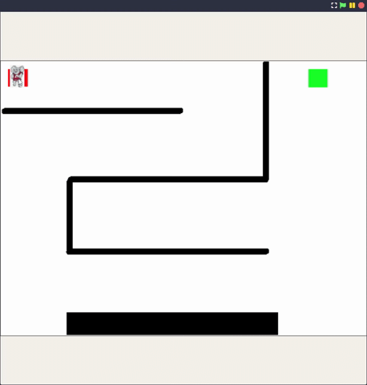
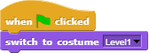

# Introduction

View this presentation any time at: [bit.ly/3mfNEaT](https://bit.ly/3mfNEaT)

## Is this your first time?

<ul class="org-ul">
<li>Has any of you already programmed?</li>
<li>Have you ever created an animation or a game?</li>
<li>Have you created a web page or used a "high level" language like
Python, C, C++, Java or JavaScript?</li>
<li>How would you describe the experience of programming?</li>
</ul>

## Session overview

-   Introduction (15 min)
-   Getting started with Snap! (30 min)
-   Building a simple animation (30 min)
-   Building a simple game (30 min)
-   Summary and wrap-up (15 min)

<ul class="org-ul">
<li><b>Why am I teaching this course?</b> Gamer, programmer, teacher.</li>
<li><b>Background:</b> teaching data science and computer science</li>
<li><b>Funny accent:</b> I am German, came to Batesville 2 years ago</li>
</ul>

## Why Snap!?

["Snap! Oh Snap!" Lyon College Course - Fall'22](https://docs.google.com/presentation/d/1f_1z4V1_tZ8PPGPil0WEUKGasgpf0jB-/edit?usp=sharing&ouid=102963037093118135110&rtpof=true&sd=true)

<ul class="org-ul">
<li><b>COR100/Y1</b>: Lyon's 1hr/week coursse teasers, fall'23 Snap! 12
students, weekly meetings of 50 minutes learning Snap!
together.</li>
<li>Final team projects: Retro Arcade Games - Donkey Kong, Pacman,
Space Invaders, and Asteroids.</li>
<li>Compared to other programming languages, visual, block-based
languages are very forgiving (computers are extremely picky and
panic easily) - attention to detail is key</li>
</ul>

## How I got started

Open project: [bit.ly/SnapTimeMachine](https://bit.ly/SnapTimeMachine)

## What is Snap?

-   Web-based HTML5 online application
-   Block-based visual programming language
-   Create animations, games, simulations
-   Open source and free to use
-   [Developed at U. Berkeley, bought by SAP](https://snap.berkeley.edu)

<ul class="org-ul">
<li>&lt;Right-Mouse&gt; View page source (HTML)</li>
<li>&lt;Right-Mouse&gt; Inspect (HTML, CSS, JavaScript, Media)</li>
<li>Developed by German programmer Jens Moenig</li>
<li>SAP is Germany's largest software company (ERP systems)</li>
<li>Unlike MIT's Scratch, Snap! can do anything</li>
<li>In programming, everything depends on data structures, e.g. numbers,
strings (that make up texts), tables, lists/dictionaries etc.</li>
<li>Languages "for anything" allow you to build such structures</li>
</ul>

# Getting started with Snap!

## Download the desktop app

-   In your browser, go to [bit.ly/3kTxX8O](https://bit.ly/3kTxX8O)
-   Download the `.zip` file
-   Extract the file to `Downloads`
-   Open `Downloads/Snap-8.2.0/snap.html`

## Run Snap! in the cloud

-   Go to [snap.berkeley.edu](https://snap.berkeley.edu)
-   Click on `Run Snap!` to program
-   Click on `Join` to keep your projects
-   Pick a simple password
-   Check your email for verification

## Snap! User Interface (UI)

-   Sprites are controlled by scripts
-   Scripts consist of command blocks
-   Sprites (characters) act on stage
-   Settings add control, input and output

<ul class="org-ul">
<li>Drag the "turtle" sprite around a little</li>
<li>Drag a "move 10 steps" block to the script area</li>
<li>Click the block / change 10 to 100 and click again</li>
</ul>

## Sprites, costumes, sounds

-   New **sprites** are created as "turtles"
-   You can create sprite **costumes** and **sounds**
-   Every sprite is controlled by its **script**
-   Create your own barking Poofie now!

<ul class="org-ul">
<li>Click on the sprite symbol below the stage</li>
<li>Open the <b>Costumes</b> tab next to the Scripts tab</li>
<li>Open the file menu at the top</li>
<li>Open the <b>Costumes</b> menu in the file menu</li>
<li>Find the <b>dog</b> costume (or <b>cat</b> if you prefer)</li>
<li>Click on the costume and <b>Import</b> it</li>
<li>Click on the <b>Sounds</b> tab</li>
<li>Open the <b>Sounds</b> menu, find <b>Dog 1</b> and <b>Import</b> it</li>
<li>Rename the sound <b>wuff</b></li>
<li>Rename the Sprite <b>Poofie</b></li>
<li>Open the <b>Scripts</b> tab</li>
<li>Open the <b>Sound</b> command block section</li>
<li>Drag <b>play sound</b> into the script area</li>
<li>Select <b>wuff</b> and click the command block</li>
</ul>

## Write your first script

## Save your first project

## If you're registered

## Any questions?

# Animating a character

## A walk in the park

Final project in the cloud: <a href="http://bit.ly/3J9RAmt">bit.ly/3J9RAmt</a>

## The project

Start a **New** project!

<ul class="org-ul">
<li>Open a new project</li>
<li>Name the project "Avery walking" or "My first animation"</li>
<li>Add some notes right away (what this is about)</li>
</ul>

## The algorithm

What's the algorithm?

Pseudocode:

<ol class="org-ol">
<li>Move object in one direction</li>
<li>Swing object's arms and legs</li>
<li>If object hits a wall, bounce back</li>
</ol>

## The illusion of walking

## The sprite

Set object **attributes** (aka sprite costumes).

<ul class="org-ul">
<li>Highlight the turtle sprite</li>
<li>Pick the costumes tab</li>
<li>Find "Avery walking" sequence</li>
<li>Highlight one after the other and import them</li>
<li>Give the Sprite a name "Avery"</li>
<li>Go to the script tab</li>
</ul>

## The script

Set object **methods** (aka sprite actions).

    - Find 'Control::forever' and drag it into the script area
    - Find 'Motion::move 10 steps' and drag it into the slot
    - Find 'Looks::next costume' and add it below (with #)
    - Find 'Control::wait 1 secs' and add it below (0.2 secs)
    - Find 'Motion::if on edge, bounce' and add it below
    - Find 'Control::when FLAG clicked' and add it at the top

If you ever "lose" your sprite, right-click on the sprite icon and
activate "show", and it will show up again. Better: reset script.

## The orientation

Set the sprite to "only face left/right".

## The background

-   **Download** the park background: [bit.ly/3SQaT7F](http://bit.ly/3SQaT7F)
-   **Import** picture as **Stage** background
-   Do a final check then **Save** your project
-   Final project in the cloud: [bit.ly/3J9RAmt](http://bit.ly/3J9RAmt)

## Any questions?

# Building a simple game

## The project

Create a new project "Mazegame"

## Setup sprite, background, sounds

    1) Download ZIP file: https://tinyurl.com/5n8xke8z
    2) Extract the file on your PC using File Explorer
    3) Create new Snap! project and save it as mazegame
    4) Set up sprite, backgrounds and sounds:
       - Set up (draggable) sprite player 
       - Set up sprite sounds for buzzer (wall), clap (level up)
       - Set up stage sound for winning the game (yea)
       - Set up stage backgrounds: three levels and final screen

## Make a new Motion block

-   Open the `Motion` command block menu
-   Click on `Make a block`
-   Enter `MovePlayer` as `Command`
-   Click on right `+` sign to add `direction`
-   Apply to all sprites

## Make start script

-   Make a start script (green flag)
-   Point in dirction 90 degrees
-   Go to starting position (`x = -218`, `y = 160`)

## Set up keyboard action

-   Down arrow: 180 degrees
-   Up arrow: 0 degrees
-   Left arrow: 270 degrees
-   Right arrow: 90 degrees

## Modify the new motion block

## Stage script

When game starts, switch to `level1`.

-   When `next-level` broadcast is received, change costume.
-   Play winning sound when all levels are finished.

## Refine the game

-   Create obstacles for the player
-   Add a monster that follows the player
-   Add prize points and penalties
-   Add a timer and a timeout penalty

[Link to the final game](https://snap.berkeley.edu/project?username=birkenkrahe&projectname=mazegame)

## Any questions?

# Summary and wrap-Up

## What you learnt (I hope)

-   How to use the Snap! UI
-   How to write a simple script
-   How to make an image move
-   How to design a simple game

## Further learning

-   Birkenkrahe (2023) Lyon College Data Science Program. URL: [lyon.edu](https://docs.google.com/presentation/d/1dSB-EIMkhJuECEgvQJ45hGODfOoZCo0aIpZ-t3EQSvc/edit?usp=sharing)
-   Huegle/Moenig (2020). Get Coding with Snap! URL:
    [open.sap.com/courses/snap1-1](https://open.sap.com/courses/snap1-1) (Free)

# References

-   Joshi (2018). Learn CS Concepts with Snap! URL: [amzn.to/3IOzsx9](https://amzn.to/3IOzsx9)
-   CSP-Alabama (2014) Mazegame. URL: [snap.berkeley.edu](https://snap.berkeley.edu/project?username=birkenkrahe&projectname=mazegame)

